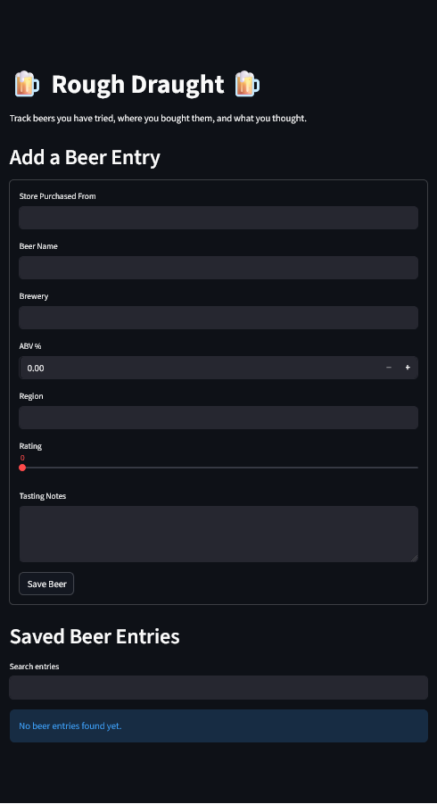
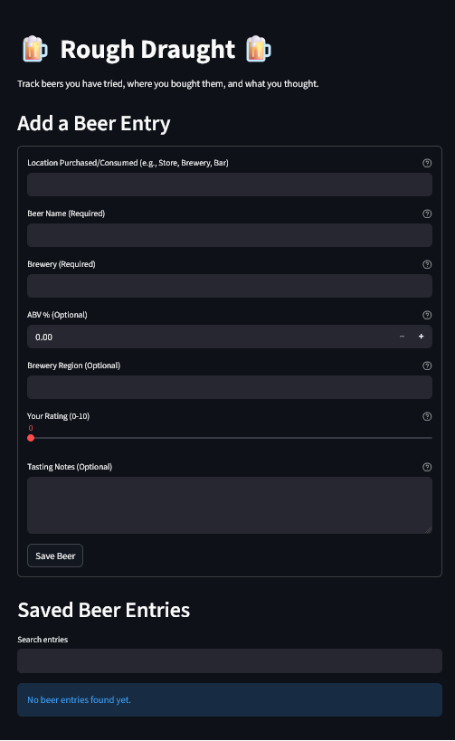
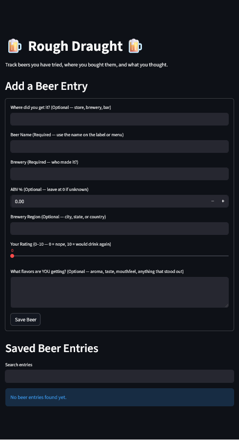

# Usability Report for Rough Draught App

## User Personas

### 1.  Alice, the Beginner Enthusiast

*   **Name:** Alice
*   **Age:** 24
*   **Background:** Recently started exploring craft beers, mostly trying recommendations from friends or local breweries. She's excited to learn more but often feels overwhelmed by the vast number of styles and breweries. She uses social media frequently but isn't a power user of complex apps.
*   **Level of Comfortability with Tech:** Moderate. She can navigate most apps but gets frustrated with unclear interfaces or too many options. She prefers simple, visually appealing apps.
*   **Specific Goal:** To remember beers she liked (and disliked) and to keep track of new breweries she discovers. She wants to build a personal history of her beer journey without feeling like she's studying for a test.

*   **Interaction with Rough Draught (Beer Entry):**
    Alice opens the app after trying a new beer at a local brewery. The interface is clean, which she appreciates. She immediately sees the "Add a Beer Entry" section.
    
    1.  **"Store Purchased From":** She might hesitate here. She didn't buy it at a store, she tried it at the brewery. She'll likely type in the brewery name again or "Brewery Taproom." This is a minor point of friction as the field is named "Store" but she's using it for a different context.
    2.  **"Beer Name":** Alice will confidently enter the beer name. She knows this is important for remembering it later.
    3.  **"Brewery":** She'll enter the brewery name again. No issues here.
    4.  **"ABV %":** This is where she might pause. She often doesn't pay attention to ABV unless it's explicitly mentioned or a very high-alcohol beer. She'll look at the can/menu if available, but if not, she might just leave it at the default `0.0` or guess.
    5.  **"Region":** This field might confuse her. Does it mean the region the beer was brewed, or where she tried it? She'll likely enter the city/state of the brewery, but it's a point of minor uncertainty.
    6.  **"Rating":** She finds the slider intuitive and will happily move it to her desired rating. She likes the visual feedback.
    7.  **"Tasting Notes":** She's eager to put down her thoughts. She'll write a few sentences, perhaps focusing on whether she liked it, the main flavors she detected, or if she'd recommend it.
    8.  **"Save Beer" button:** She'll click this, expecting her entry to be saved.

*   **Friction Points & Frustrations:**
    *   **"Store Purchased From" field name:** The name is slightly misleading when a beer is consumed on-premise at a brewery or bar.
    *   **ABV %:** Not always readily available or top-of-mind for her. The default `0.0` is acceptable but she might prefer a "N/A" or simply leaving it blank without a default.
    *   **"Region" field clarity:** Ambiguity between brewery location and where she consumed the beer.

### 2.  David, the Data-Driven Connoisseur

*   **Name:** David
*   **Age:** 38
*   **Background:** A seasoned craft beer enthusiast with a strong analytical mind. He meticulously tracks everything he consumes, from beer to coffee to books. He uses various apps for logging data (e.g., Untappd for social beer logging, but he wants something more personal), spreadsheets for personal finance, and is comfortable with advanced features and customization. He enjoys diving deep into details.
*   **Level of Comfortability with Tech:** Very High. He's an early adopter, comfortable with complex interfaces, and expects apps to be powerful and efficient. He values data integrity and robust search/filtering capabilities.
*   **Specific Goal:** To create a comprehensive personal database of his beer experiences, allowing him to track trends, analyze his preferences over time, and revisit specific tasting notes. He wants to leverage his data for informed purchasing decisions and to deepen his understanding of beer styles and regions.
*   **Interaction with Rough Draught (Beer Entry):**
    David approaches the app with a critical eye, looking for efficiency and data granularity. He has just tried a new stout from a highly-regarded brewery.

    1.  **"Store Purchased From":** He will precisely enter where he purchased it, often including the specific bottle shop or online retailer. He might wish for a dropdown of previously entered stores for speed.
    2.  **"Beer Name":** He will accurately enter the full beer name, including any special editions or vintage information if applicable.
    3.  **"Brewery":** He'll enter the exact brewery name.
    4.  **"ABV %":** He will seek out the exact ABV and enter it precisely. He might wish for an option to include IBU (International Bitterness Units) or specific style tags.
    5.  **"Region":** He'll enter the specific region/state of the brewery. He might want more granular options, like a dropdown for countries and states within them.
    6.  **"Rating":** He will carefully consider his rating, possibly comparing it to similar beers he's logged. The slider is acceptable, but he might prefer a direct number input for speed and precision if he already has a number in mind.
    7.  **"Tasting Notes":** This is where David shines. He will write detailed, structured notes, often including aroma, appearance, flavor, mouthfeel, and overall impression. He might wish for formatting options (bolding, bullet points) or predefined tags for common descriptors.
    8.  **"Save Beer" button:** He expects the entry to be saved immediately and efficiently.

*   **Friction Points & Frustrations:**
    *   **Lack of advanced fields:** No options for IBU, beer style, packaging type (can/bottle/draft), or purchase date (only timestamp is auto-generated).
    *   **No auto-completion or dropdowns:** For fields like "Store," "Brewery," and "Region," he'd expect suggestions from previous entries to speed up data input.
    *   **Limited rating granularity:** While 0-10 is okay, he might prefer decimal ratings (e.g., 8.5).
    *   **Basic text area for notes:** Lacks formatting options or predefined tags for structured data entry.
    *   **Search functionality:** While there is a search, it's a global text search. David would desire more structured filtering options (e.g., filter by brewery, region, or rating range).

### 3.  Sarah, the Distracted Explorer

*   **Name:** Sarah
*   **Age:** 29
*   **Background:** Sarah is a busy professional with ADHD. She loves trying new things, including craft beers, but her attention often wanders, and she struggles with multi-step processes or interfaces that demand sustained focus. She frequently switches between tasks and needs apps to be forgiving, quick, and visually uncluttered. She uses reminders and quick-note apps extensively.
*   **Level of Comfortability with Tech:** High, but with a preference for simplicity and speed. She's adept at finding workarounds but gets easily overwhelmed by visual clutter, pop-ups, or lengthy forms. Efficiency and minimal cognitive load are key.
*   **Specific Goal:** To quickly log a beer she's trying before her attention shifts, capturing enough information to jog her memory later. She needs the process to be as frictionless as possible, even if it means sacrificing some detail.
*   **Interaction with Rough Draught (Beer Entry):**
    Sarah has just opened a new, exciting beer but is also simultaneously checking her email and chatting with a friend. She remembers she wanted to log this one.

    1.  **"Store Purchased From":** She might quickly type in "local store" or just leave it blank if she's in a hurry or can't immediately recall. She might skip this field altogether if not prompted to fill it.
    2.  **"Beer Name":** This is critical, so she'll focus and get the name right. She might even copy-paste from an online source if she's looking up the beer.
    3.  **"Brewery":** She'll enter this, but might make a typo if rushing.
    4.  **"ABV %":** She'll likely skip this unless it's a prominent number on the can/bottle and she spots it immediately. The `0.0` default might confuse her, making her wonder if it's required.
    5.  **"Region":** She'll probably skip this or enter a very general term like "USA" if she feels she has to type something.
    6.  **"Rating":** She'll quickly drag the slider to a general "good" or "okay" spot (e.g., 7 or 8) without much deliberation. She likes the immediacy.
    7.  **"Tasting Notes":** This is a big hurdle. She might start typing a note, get distracted, and then forget what she was going to write. She might type one word (e.g., "Hoppy") or leave it blank entirely, intending to come back to it later (but rarely does).
    8.  **"Save Beer" button:** She'll hit this, relieved the process is over. If there's an error message (like for missing fields), she might get frustrated and abandon the entry.

*   **Friction Points & Frustrations:**
    *   **Multiple text input fields:** Requires sustained focus to type in each one. She might prefer fewer mandatory fields or more checkboxes/dropdowns.
    *   **No immediate visual confirmation of saved state (beyond toast message):** She might wonder if it actually saved, especially if she navigates away quickly.
    *   **ABV/Region can be skipped/left blank:** The presence of these fields, especially with a `0.0` default for ABV, feels like a requirement and can be a barrier if she doesn't know the info.
    *   **"Tasting Notes" as a large text area:** Intimidating for quick, unstructured thoughts. She might prefer a few quick tags or a voice-to-text option.

### 4.  Robert, the Casual Veteran

*   **Name:** Robert
*   **Age:** 62
*   **Background:** Robert has been enjoying beer for decades, but only recently started exploring the vast world of craft brews. He appreciates quality but isn't interested in becoming a connoisseur. He wants a simple way to remember the names of beers he liked, especially when he's at the store and can't recall what he previously enjoyed. He uses his smartphone for essentials like calls, email, and basic web browsing, but avoids anything overly complicated.
*   **Level of Comfortability with Tech:** Low to Moderate. He can navigate familiar apps but is easily confused by new interfaces, pop-ups, or too many steps. He values straightforward functionality and clear instructions. He dislikes typing on his phone and prefers to keep interactions minimal.
*   **Specific Goal:** To maintain a simple, easy-to-access list of beers he has tried and his basic opinion of them, primarily for reference when purchasing beer. He wants to avoid buying the same beer twice if he didn't like it.
*   **Interaction with Rough Draught (Beer Entry):**
    Robert is at home, reflecting on a new beer he tried earlier in the day. He opens the app with the intention of making a quick note.

    1.  **"Store Purchased From":** He'll likely leave this blank or type something generic like "Liquor Store" unless a specific store stands out. He might forget where he bought it.
    2.  **"Beer Name":** This is crucial for him, so he'll carefully type the beer name, possibly looking at the can/bottle for accuracy.
    3.  **"Brewery":** He'll type the brewery name.
    4.  **"ABV %":** He will almost certainly skip this field. It's not information he typically tracks or cares about.
    5.  **"Region":** Another field he will likely skip. He cares more about the taste than the origin.
    6.  **"Rating":** He'll use the slider, but it might take him a moment to understand how it works. He'll gravitate towards a simple "good" (6-8) or "bad" (2-4) rating.
    7.  **"Tasting Notes":** He might type a very short note, like "smooth" or "too bitter," but he's more likely to leave it blank. He doesn't enjoy typing extensively on his phone.
    8.  **"Save Beer" button:** He'll click this, hoping it worked and his simple entry is recorded.

*   **Friction Points & Frustrations:**
    *   **Too many fields for his needs:** He finds the "Store," "ABV," and "Region" fields unnecessary and potentially overwhelming.
    *   **Typing on a mobile device:** The number of text input fields is a significant barrier for him.
    *   **ABV % default:** The `0.0` default for ABV makes him wonder if he *must* enter something, even though he doesn't want to.
    *   **No clear indication of optional fields:** He assumes all fields need to be filled, leading to frustration when he doesn't have the information or doesn't care to provide it.
    *   **Searching:** While there's a search, he might find it difficult to use if he only remembers part of a beer name or a generic descriptor.

### 5.  Chloe, the Social Sharer (who also values privacy)

*   **Name:** Chloe
*   **Age:** 31
*   **Background:** Chloe is active on social media and enjoys sharing her experiences, including new beers she tries. However, she's also conscious of her digital footprint and prefers to control what information she shares publicly. She uses apps like Instagram, Pinterest, and sometimes Untappd, but finds Untappd a bit too public and overwhelming at times. She values aesthetics and ease of sharing.
*   **Level of Comfortability with Tech:** High. She's comfortable with various apps, enjoys discovering new ones, and expects seamless experiences. She's adept at taking photos and crafting concise, engaging captions.
*   **Specific Goal:** To privately log her beer experiences with the option to easily share *selected* entries or specific details with friends, without feeling pressured to engage in a public social network. She wants a personal record that she can curate and selectively broadcast.
*   **Interaction with Rough Draught (Beer Entry):**
    Chloe has just tried a visually stunning and delicious new sour beer at a trendy bar. She wants to remember it and potentially share a photo with a friend later.

    1.  **"Store Purchased From":** She'll enter the bar's name. She might wish for a location tag or a quick way to add a map link.
    2.  **"Beer Name":** She'll carefully enter the full name, ensuring accuracy.
    3.  **"Brewery":** She'll enter the brewery name.
    4.  **"ABV %":** She'll typically look for this information as it's a common detail shared among friends, and she likes to be informed.
    5.  **"Region":** She'll enter the region of the brewery. She might consider adding a note if the beer was a collaboration from multiple regions.
    6.  **"Rating":** She'll thoughtfully assign a rating, considering how it compares to others she's had. She sees this as a key piece of information for personal tracking and potential sharing.
    7.  **"Tasting Notes":** She'll write concise, descriptive notes, often focusing on flavors, aromas, and her overall impression, similar to a mini-review. She might mentally compose it with the idea of sharing parts of it later.
    8.  **"Save Beer" button:** She'll click this, expecting a smooth save. She might then look for a share button or a way to export the entry.

*   **Friction Points & Frustrations:**
    *   **No photo upload option:** A significant limitation for a visual sharer. She can't attach a photo of the beer or label.
    *   **No integrated sharing features:** She would expect a quick way to share an entry (or a screenshot of it) to social media or messaging apps.
    *   **Lack of advanced input for location:** While "Store Purchased From" works, she might want more robust location tagging or even GPS integration.
    *   **Search and display of entries:** While the `st.dataframe` displays entries, it's not visually engaging for sharing. The expander for tasting notes is a good start, but she might want a more aesthetically pleasing display that she could screenshot and share.

### 6.  Mike, the "Tailgater"

*   **Name:** Mike
*   **Age:** 45
*   **Background:** Mike is a casual beer drinker who enjoys hanging out with friends, especially at sporting events or backyard BBQs. He primarily drinks familiar, mass-market beers, but occasionally tries a craft beer if a friend recommends it or it has a cool label. He doesn't pay much attention to tasting notes or intricate details; he just wants to know if he liked it and where he can get it again. He uses his phone for calls, texts, and checking sports scores. His app usage is minimal and task-oriented.
*   **Level of Comfortability with Tech:** Low. He tolerates essential apps but gets easily annoyed by anything that feels like extra work. He prefers to get things done quickly and move on. He might forget passwords or how to navigate less-frequently used apps.
*   **Specific Goal:** To quickly remember where he bought a beer he enjoyed, so he can easily repurchase it. He is not interested in detailed logging or becoming a beer expert.
*   **Interaction with Rough Draught (Beer Entry):**
    Mike is at a friend's tailgate, trying a new local IPA that he surprisingly enjoys. He remembers his friend told him to log it in this app.

    1.  **"Store Purchased From":** This is the *most important* field for Mike. He will carefully enter the name of the store or even a general location if he can't recall the exact name (e.g., "Total Wine - South Loop"). He might spend the most time on this field.
    2.  **"Beer Name":** He'll try to get this right, probably looking at the can/bottle. This is his second most important field.
    3.  **"Brewery":** He might skip this if he's not familiar with the brewery or is in a hurry. If he does enter it, it will be a quick, unverified entry.
    4.  **"ABV %":** He will absolutely skip this. He doesn't care about ABV unless it's exceptionally high, and even then, he probably wouldn't log it.
    5.  **"Region":** He will skip this field entirely. It's irrelevant to his goal.
    6.  **"Rating":** He might quickly move the slider to a "good" rating (7 or 8) if he really liked the beer, or leave it at `0` if he didn't care enough to move it. He views it as a quick sentiment capture.
    7.  **"Tasting Notes":** He will almost certainly skip this field. He is not interested in writing detailed notes.
    8.  **"Save Beer" button:** Mike is prone to distraction. He might fill in the few fields he cares about and then close the app or switch to another task, forgetting to hit "Save Beer." If he does remember, he'll hit it without much thought.

*   **Friction Points & Frustrations:**
    *   **Non-essential fields:** The presence of ABV, Region, and Tasting Notes feels like clutter and unnecessary work, increasing the likelihood of him skipping them or abandoning the entry.
    *   **Reliance on manual "Save Beer" button:** He needs more prominent or automatic saving mechanisms, or at least a warning if he tries to navigate away from an unsaved entry.
    *   **Search functionality:** While he would use the search, it needs to be very forgiving for partial names or common store types. He won't remember exact spellings.

## General Summary and Friction Points Across Personas

This usability report highlighted a few consistent issues across different types of users. While the app is simple and easy to understand at a glance, some parts of the form create hesitation or feel like extra work.

The biggest problems were unclear field labels, too many inputs for casual users, and not enough guidance when entering tasting notes.

By simplifying the form, making optional fields more obvious, and improving the wording, the app can feel faster and more natural to use without losing functionality.

## Before

## After with AI

## After with my changes

